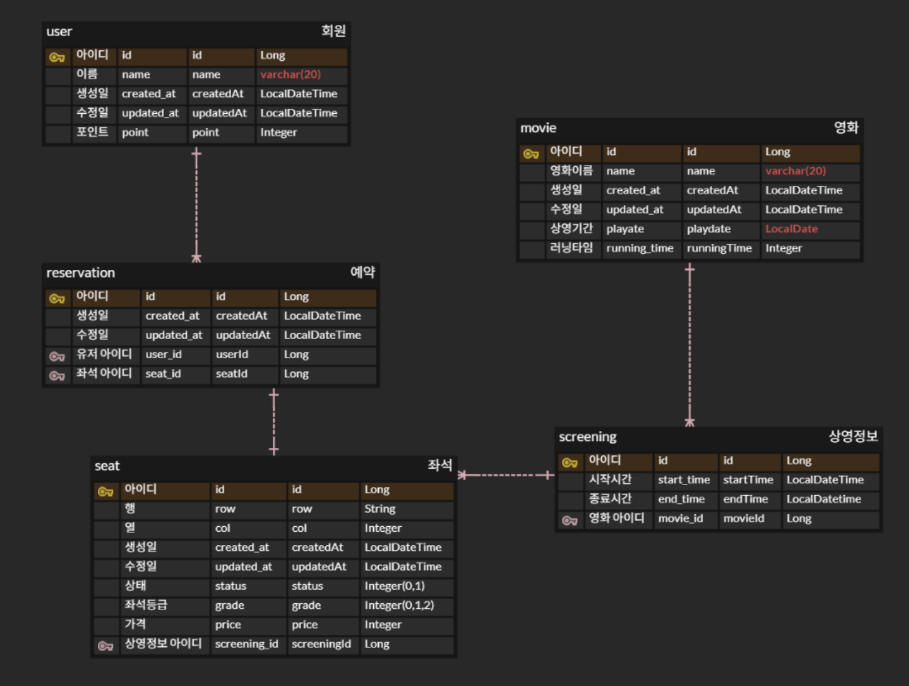

# java-movie-precourse

### 구현기능 목록
1. 영화는 상영 기간 내에 여러 차례 상영가능
2. 여러 영화를 한 번에 예매 가능, 겹치는 경우 예매x
3. 사용자는 영화 및 좌석 선택 예매 가능
4. 이미 예약된 좌석은 예매 불가능
5. 예매자 추가 혜택(무비데이, 시간조건, 혜택 우선순위 있음)
6. 사용자 포인트 혜택
7. 결제 수단에 따른 추가 할인 기능

### 구현 전략
- ERD 구성(erd cloud 활용)
- 계층형 패키지 구조 사용
- gradle 목록 참고 및 추가X
- 프로그래밍 요구 사항 1,2 준수
- 테스트 given-when-then 사용
- GPT 같은 AI 도구 활용 예시
    - ERD 잘짰는지 여부
    - 코드를 그대로 뺏기기 x 최대한 내가 구현 오직 참고만
    - 코드를 최대한 이해하기
- Google Java Style Guide 학습하기
- Angular JS Git Commit Message Conventions 참고

### ERD 구현

### AI 활용 부분
1. ERD 구성 도움
2. ReservationServiceImpl 구현부분
  - 가격 계산
  - 상영 겹침 확인
  - 좌석 검증 로직
3. LocalDateTime 활용
4. 전체적인 로직 검사
5. 도메인 추가 수정
  - 결제 방식 추가
  - 스크린 도메인 상영 시간 추가

### 지키지 못한 부분
1. 메서드는 한가지 일만 해야한다
2. 메서드 15줄 이하

